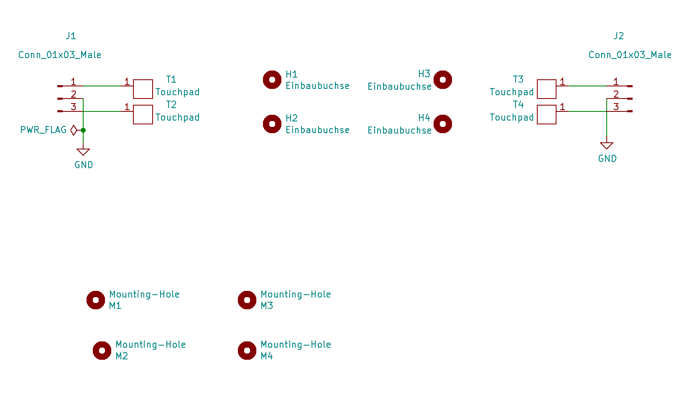
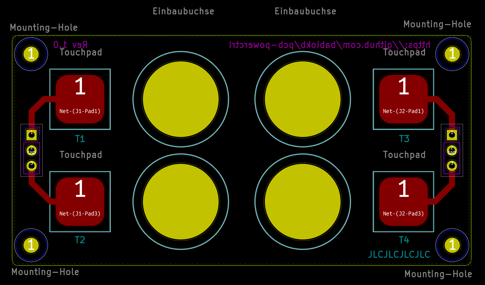
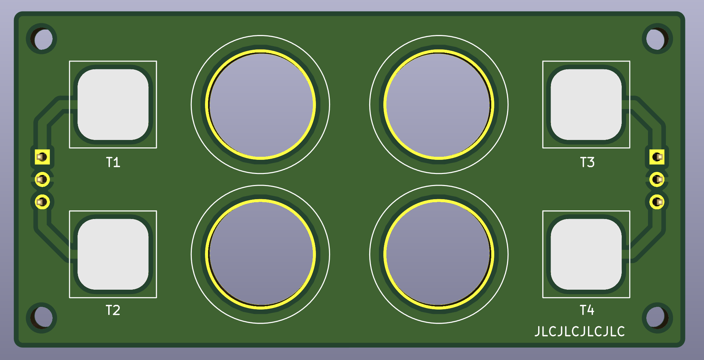

pcb-powerctrl
=============

This project contains the KiCAD-project-files for a  small pcb with touchpads
and drill holes for 5,5/2,1 sockets. The KiCAD-sources are in the sub-directory
[pcb-powerctrl](pcb-powerctrl), production-files with gerber-layers and drill-hole files are
in the sub-directory [production](production).

Schematic
---------

Layout
------

3D-View
-------

